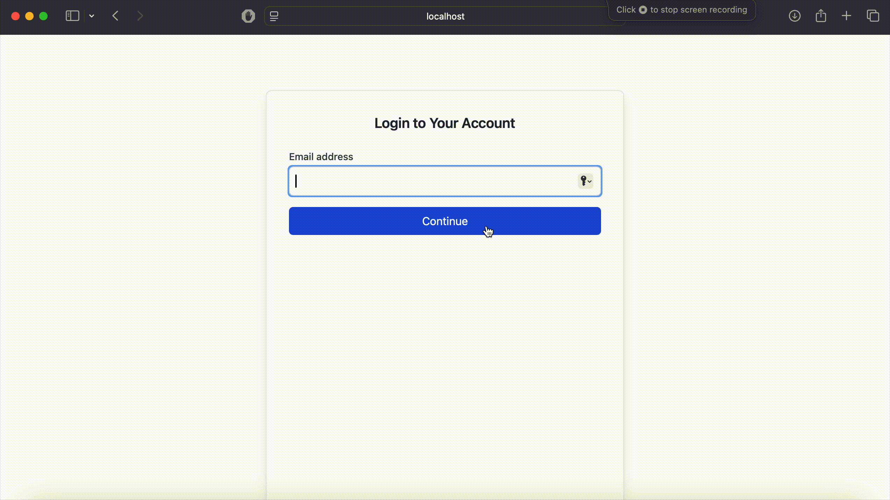
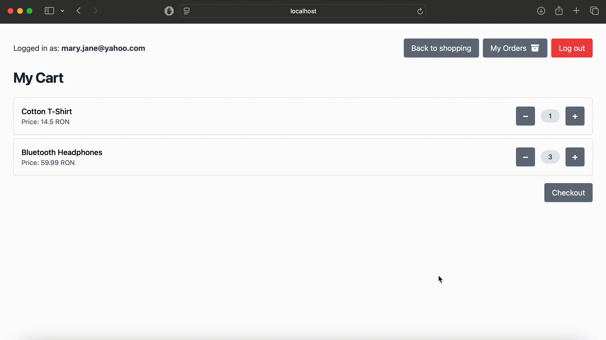

# 🛒 Online Store

This project is a **proof of concept** for an online shopping platform built with a **microservices architecture**, using asynchronous messaging and real-time updates.

---

## 📦 Technologies

| Technology            | Purpose                                  |
|------------------------|-------------------------------------------|
| **Java 17**             | Core language for backend services      |
| **Spring Boot**        | REST APIs, Kafka integration, WebSockets  |
| **Maven**              | Java build and dependency management      |
| **React + Vite**       | Frontend UIs for customer & store         |
| **Apache Kafka**       | Async event-driven communication          |
| **PostgreSQL**         | Relational database                       |
| **Docker**     | Container orchestration                   |
| **WebSocket (STOMP)**  | Real-time communication (UI updates)      |
| **Lombok**             | Java boilerplate reduction                |

---

## 🗂 Project Structure

```
├── online-shop/order-api/         # Customer backend (Spring Boot)
├── online-shop-customer-ui/       # Customer frontend (React + Vite)
├── online-shop/order-processor/   # Store backend (Spring Boot)
├── online-shop-store-ui/          # Store frontend (React + Vite)
└── docker-compose.yml             # Docker orchestration           
```

---

## 🔁 Microservice Communication

| Flow                             | Transport         |
|----------------------------------|-------------------|
| `online-shop-customer-ui ➝ order-api`           | REST              |
| `order-api ➝ order-processor`        | Kafka (`order_created_topic`) |
| `online-shop-store-ui ➝ order-processor`     | REST |
| `order-processor ➝ order-api`        | Kafka (`order-updated-topic`) |
| `order-api ➝ online-shop-customer-ui`     | WebSocket         |
| `order-processor ➝ online-shop-store-ui`     | WebSocket  |

---

## 🐳 Running with Docker Compose

```bash
docker-compose up --build
```

---

## Functionalities

### 🧑 Customer (order-api + online-shop-customer-ui)


#### Login/Create account with email



#### View products, search by name


#### Add/remove products from cart


#### Place order



#### View order history


#### Receive status updates in real-time


### 🏬 Store (order-processor + online-shop-store-ui)

#### Receive orders in real time
#### Display all orders with product breakdown
#### Update order status (`PENDING ➝ PROCESSING ➝ IN_TRANSIT ➝ DELIVERED`)


---

